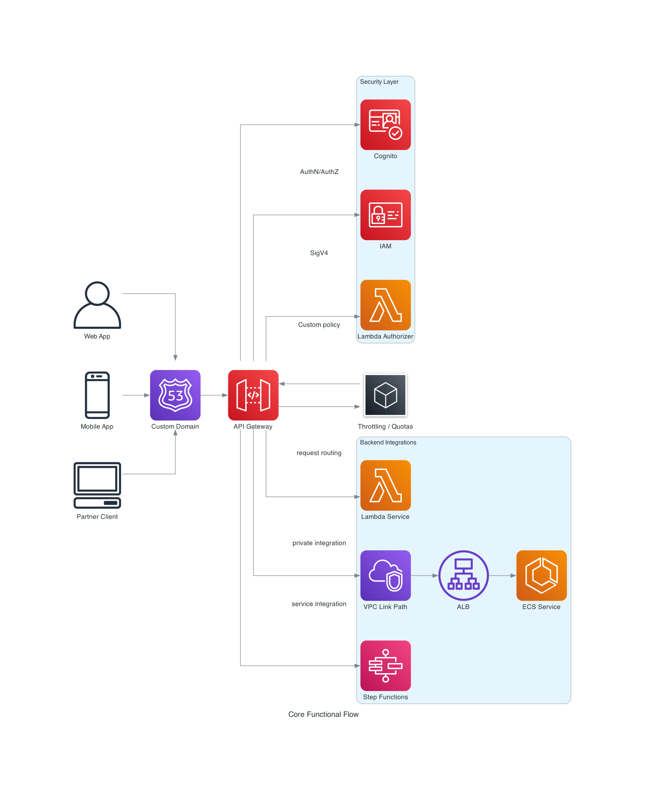
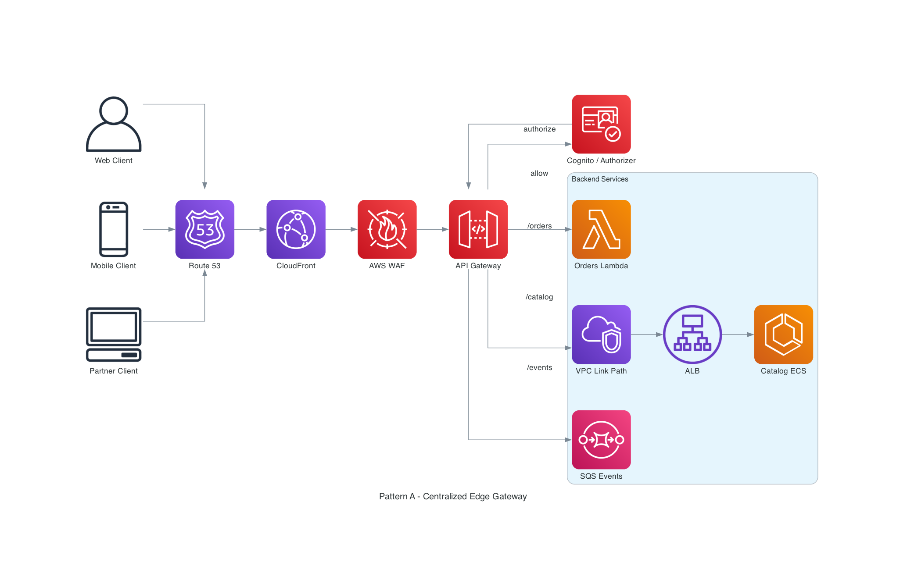
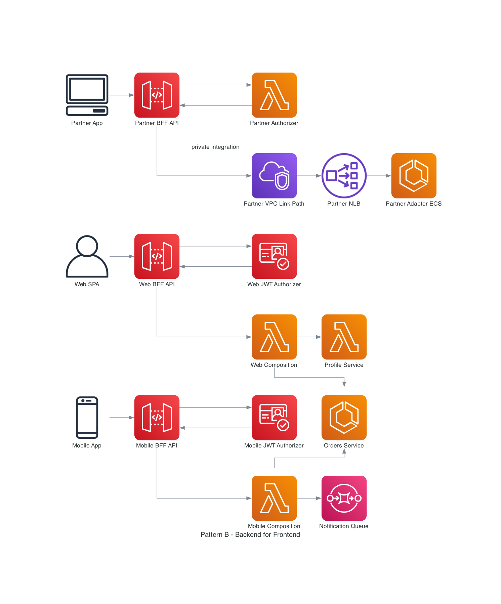
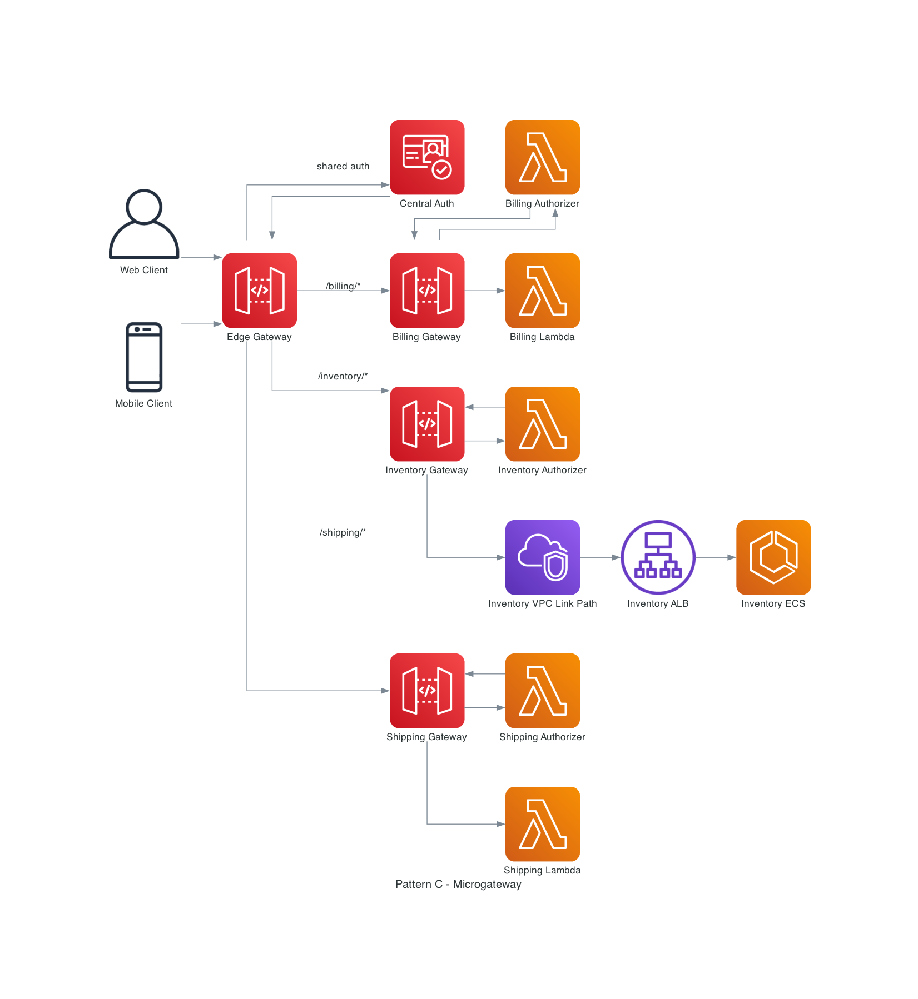
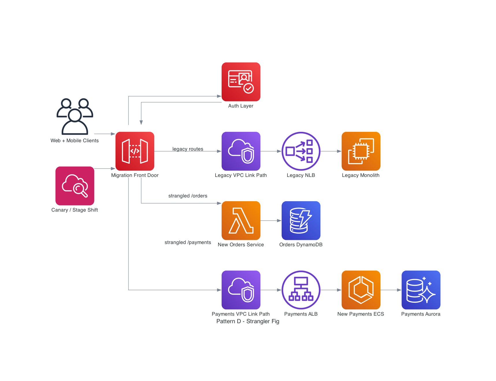
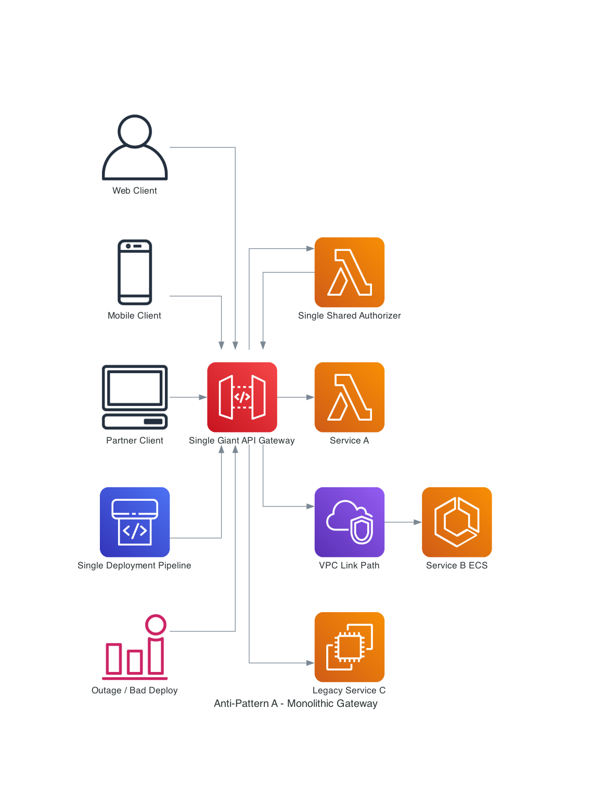
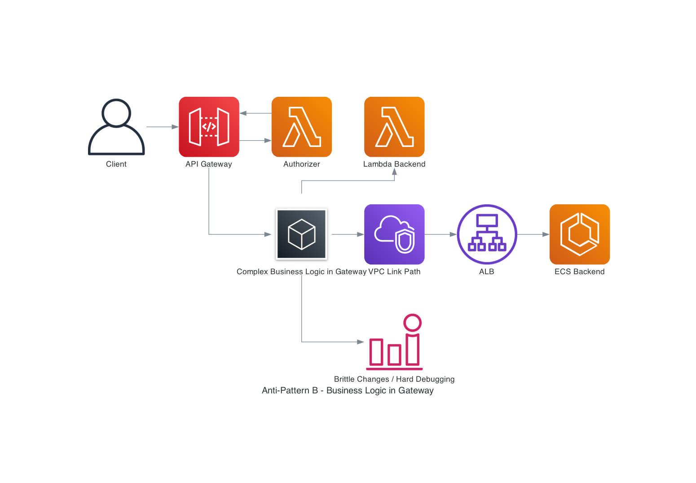
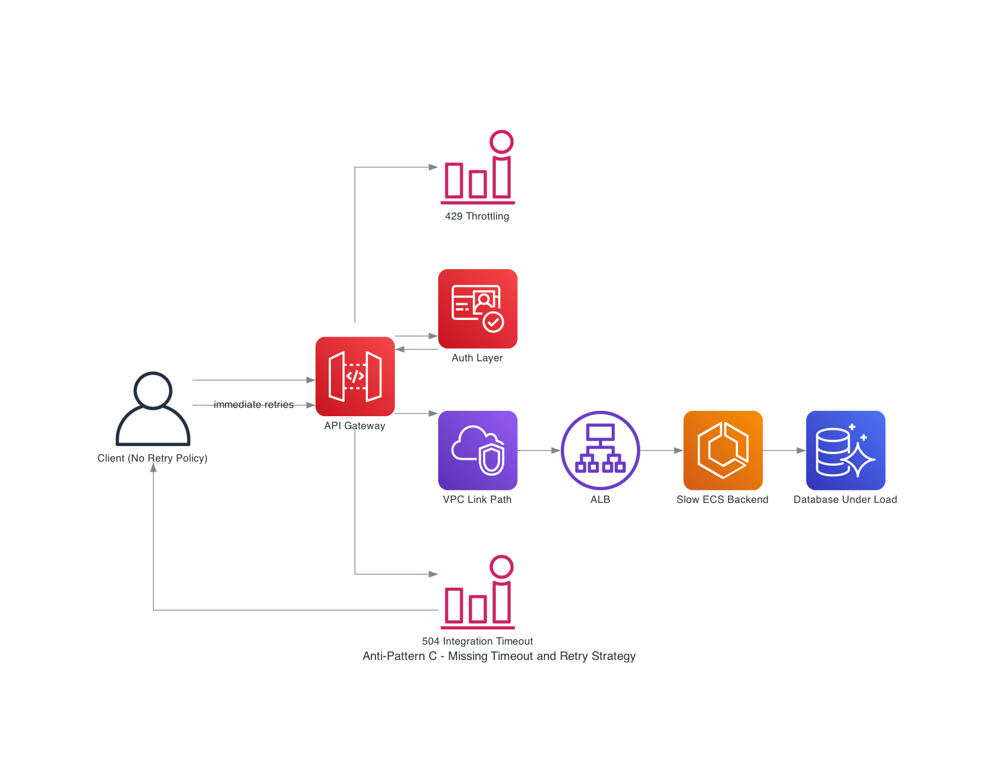

# AWS API Gateway: Architecture Patterns Visual Guide

This guide is written for architecture design and solution reviews where API Gateway is the API front door. It focuses on practical trade-offs, when to use each API type, and how to avoid common failure modes.

## 1) Core Functionalities

### Capability overview

| Capability | What API Gateway does | Design note |
| --- | --- | --- |
| Request routing | Routes by path, method, host, and route keys (WebSocket) | Keep route ownership clear per domain/team |
| Authentication and authorization | Supports IAM auth, Amazon Cognito, Lambda authorizers, and JWT authorizers (HTTP APIs) | Enforce auth on every route; do not leave public defaults accidentally |
| Throttling and quotas | Token-bucket throttling with account/stage/route/method controls; usage plans for REST APIs | Treat limits as best-effort targets, not hard enforcement |
| Protocol translation | Fronts Lambda, AWS services, HTTP backends, and private VPC targets via VPC Link | Use proxy-style integrations unless transformation is truly needed |
| Payload transformation | REST: parameter mapping + mapping templates (VTL); HTTP API: parameter mapping | Keep transformations simple and observable; avoid hidden business logic |

### Reference request flow

### Practical guidance per core capability

1. Request Routing
   - Use path-based route ownership (for example, `/orders/*`, `/catalog/*`, `/billing/*`) to avoid cross-team collisions.
   - For WebSocket APIs, design a stable `routeSelectionExpression` contract (for example, `${request.body.action}`).

2. Authentication and Authorization
   - Use JWT authorizers (HTTP APIs) for low-latency token validation at scale.
   - Use Lambda authorizers when policy decisions require custom context (tenant, plan, dynamic entitlement).
   - For REST APIs requiring resource policies, WAF integration, and private endpoints, keep authorization layered: edge policy + method/route auth.

3. Throttling
   - Define account guardrails first, then route/method targets.
   - For REST productization, add usage plans and API keys, but do not treat them as hard security boundaries.
   - Return actionable error details on `429` and document client retry behavior.

4. Protocol Translation
   - Use direct AWS integrations where possible to reduce operational hops.
   - Use VPC Link for private backends (ALB/NLB/Cloud Map depending on API type and architecture).

5. Payload Transformation
   - Prefer proxy integrations for long-term maintainability.
   - Use transformation only for compatibility boundaries (legacy payloads, header normalization, simple response shaping).

---

## 2) Use Cases: REST APIs vs HTTP APIs vs WebSocket APIs

### Decision matrix

| API type | Best for | Strong capabilities | Trade-offs |
| --- | --- | --- | --- |
| REST API | Enterprise APIs needing advanced controls | API keys, usage plans, per-client throttling, request validation, WAF integration, private endpoints, caching, canary deployment, execution logs, X-Ray | Higher feature surface and management overhead |
| HTTP API | Cost and latency optimized synchronous APIs | Simpler setup, JWT auth, Lambda authorizers, IAM auth, automatic deployments, route-level throttling, private integrations | Fewer advanced management and transformation features than REST |
| WebSocket API | Stateful, real-time bidirectional interactions | `$connect`/`$disconnect`/`$default`, route-based message handling, server-to-client callbacks via `@connections` | Connection lifecycle management and state handling complexity |

### Selection heuristics

1. Choose REST API when you need strict API product controls (API keys/usage plans), private endpoint type, deep governance, or advanced lifecycle features.
2. Choose HTTP API when you need high-throughput synchronous APIs with minimal platform overhead and modern JWT-based auth.
3. Choose WebSocket API when clients must receive pushed updates without polling (chat, collaboration, live dashboards, market feeds).

---

## 3) Architectural Patterns

### Pattern A: Centralized Edge Gateway

A single API entry point for many domains, with shared security and governance controls at the edge.

When it fits:
- Multi-channel platforms (web/mobile/partner) that need consistent policy enforcement.
- Organizations that need centralized auditing, WAF controls, and standard observability.

Trade-offs:
- Strong consistency and control.
- Risk of heavy cross-team coupling if route ownership boundaries are not clear.

#### Traffic flow diagram

### Pattern B: Backend-for-Frontend (BFF)

Separate API Gateway front doors per client experience (web, mobile, partner), each optimized for that channel.

When it fits:
- Client channels have materially different payload shapes, latency needs, and release cadence.
- You want independent deployments without one client channel blocking another.

Trade-offs:
- Better user experience and team autonomy.
- More APIs to manage; require shared standards and governance guardrails.

#### Traffic flow diagram

### Pattern C: Microgateway (Domain-Owned API Front Doors)

Each domain/service owns a smaller API Gateway boundary and lifecycle. A thin edge gateway handles coarse ingress concerns.

When it fits:
- Platform-scale microservices with independent domain teams.
- Need to reduce blast radius from gateway config/deployment changes.

Trade-offs:
- Strong ownership and reduced coupling.
- Requires mature platform governance for standards (auth, logging, naming, quotas).

#### Traffic flow diagram

### Pattern D: Strangler Fig Migration

Use API Gateway as a routing control plane to incrementally move endpoints off a legacy monolith.

When it fits:
- Legacy monolith modernization without a risky big-bang cutover.
- Need route-level progressive migration with measurable rollback points.

Trade-offs:
- Low migration risk with controlled rollout.
- Requires disciplined routing/versioning strategy and observability for parity checks.

#### Traffic flow diagram

---

## 4) Architectural Anti-Patterns

### Anti-Pattern A: Monolithic Gateway (Single Point of Failure)

A single, oversized gateway deployment and policy surface for everything, often in one Region/stage/account boundary.

Why it is risky:
- One bad deployment can break all APIs.
- Tight coupling blocks team autonomy and release speed.
- Blast radius is too large for high-change systems.

Preferred correction:
- Split by domain (BFF or Microgateway), define ownership boundaries, and reduce shared mutable configuration.

#### Anti-pattern traffic flow diagram

### Anti-Pattern B: Deep Business Logic Embedded in API Gateway

Gateway mappings and authorizers become an application runtime (complex branching, orchestration, pricing logic, entitlements).

Why it is risky:
- Hard to test and version compared to code in Lambda/ECS services.
- Weak observability and debuggability for business behavior.
- Gateway changes become high-risk and tightly coupled to domain logic.

Preferred correction:
- Keep API Gateway focused on ingress concerns; move domain logic into versioned backend services.

#### Anti-pattern traffic flow diagram

### Anti-Pattern C: Missing Timeout and Retry Strategy

No explicit timeout budget, no bounded retries with jitter, and no client-side resilience policy.

Why it is risky:
- Slow backends cause API timeout errors (for example integration timeout -> 504 response).
- Naive retries create retry storms and secondary outages.
- Throttling (`429`) increases as clients amplify load during incidents.

Preferred correction:
- Set explicit end-to-end timeout budgets.
- Implement bounded retries with exponential backoff and jitter at one layer.
- Add circuit breaking and graceful degradation where possible.

#### Anti-pattern traffic flow diagram

---

## Recommended Guardrails Checklist

1. Enforce authorization on every route (`deny-by-default`).
2. Define clear route ownership boundaries by domain and team.
3. Keep transformations minimal; avoid embedding business workflow in gateway configuration.
4. Apply throttling at account + stage/route/method levels; monitor `429` and integration latency.
5. Define explicit timeout budgets from client through backend and test them under load.
6. Implement retry with exponential backoff and jitter in a single chosen layer.
7. For modernization, use strangler routing with measurable rollout and rollback controls.

---

## References (AWS)

- [Choose between REST APIs and HTTP APIs](https://docs.aws.amazon.com/apigateway/latest/developerguide/http-api-vs-rest.html)
- [Overview of WebSocket APIs in API Gateway](https://docs.aws.amazon.com/apigateway/latest/developerguide/apigateway-websocket-api-overview.html)
- [Control and manage access to HTTP APIs](https://docs.aws.amazon.com/apigateway/latest/developerguide/http-api-access-control.html)
- [Use API Gateway Lambda authorizers](https://docs.aws.amazon.com/apigateway/latest/developerguide/apigateway-use-lambda-authorizer.html)
- [Throttle requests to your REST APIs](https://docs.aws.amazon.com/apigateway/latest/developerguide/api-gateway-request-throttling.html)
- [Throttle requests to your HTTP APIs](https://docs.aws.amazon.com/apigateway/latest/developerguide/http-api-throttling.html)
- [Usage plans and API keys for REST APIs](https://docs.aws.amazon.com/apigateway/latest/developerguide/api-gateway-api-usage-plans.html)
- [Data transformations for REST APIs](https://docs.aws.amazon.com/apigateway/latest/developerguide/rest-api-data-transformations.html)
- [Transform API requests and responses for HTTP APIs](https://docs.aws.amazon.com/apigateway/latest/developerguide/http-api-parameter-mapping.html)
- [Create private integrations for HTTP APIs](https://docs.aws.amazon.com/apigateway/latest/developerguide/http-api-develop-integrations-private.html)
- [Gateway response types for API Gateway](https://docs.aws.amazon.com/apigateway/latest/developerguide/supported-gateway-response-types.html)
- [Retry with backoff pattern (AWS Prescriptive Guidance)](https://docs.aws.amazon.com/prescriptive-guidance/latest/cloud-design-patterns/retry-backoff.html)
