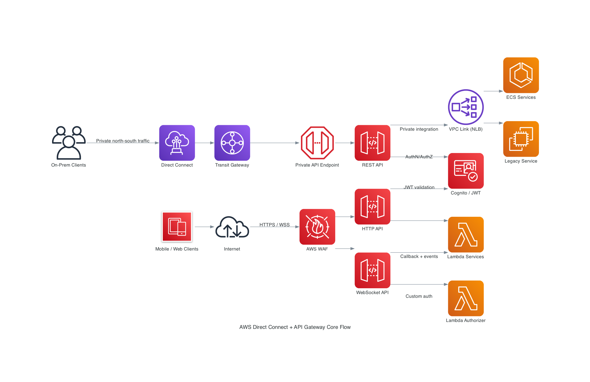
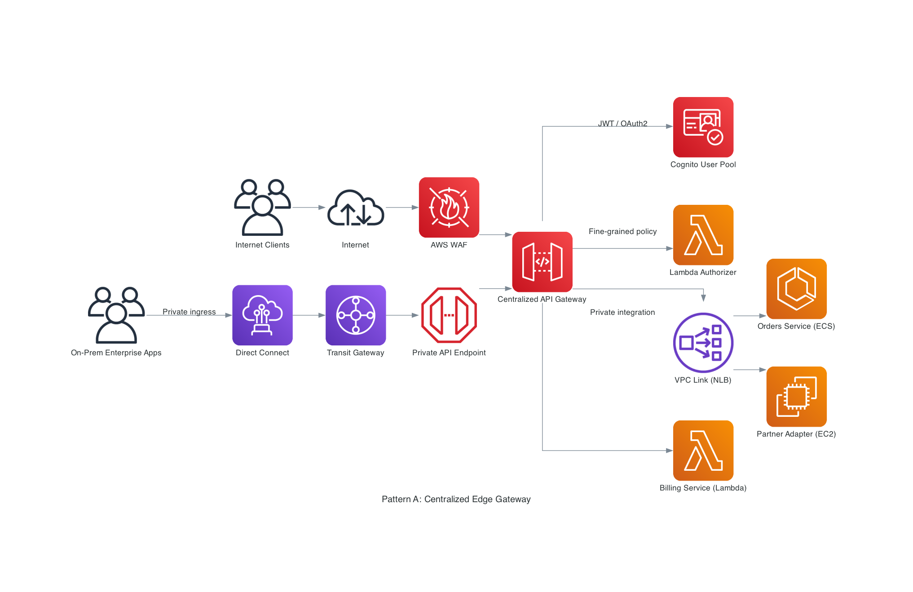
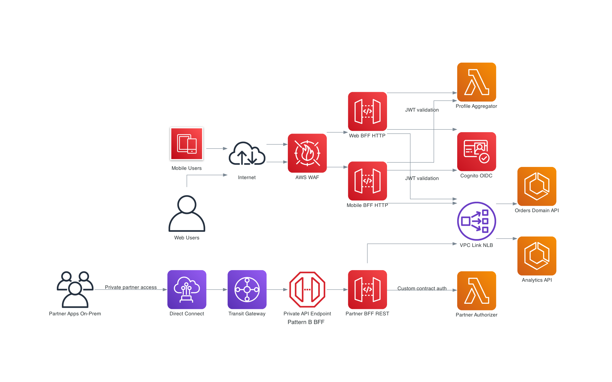
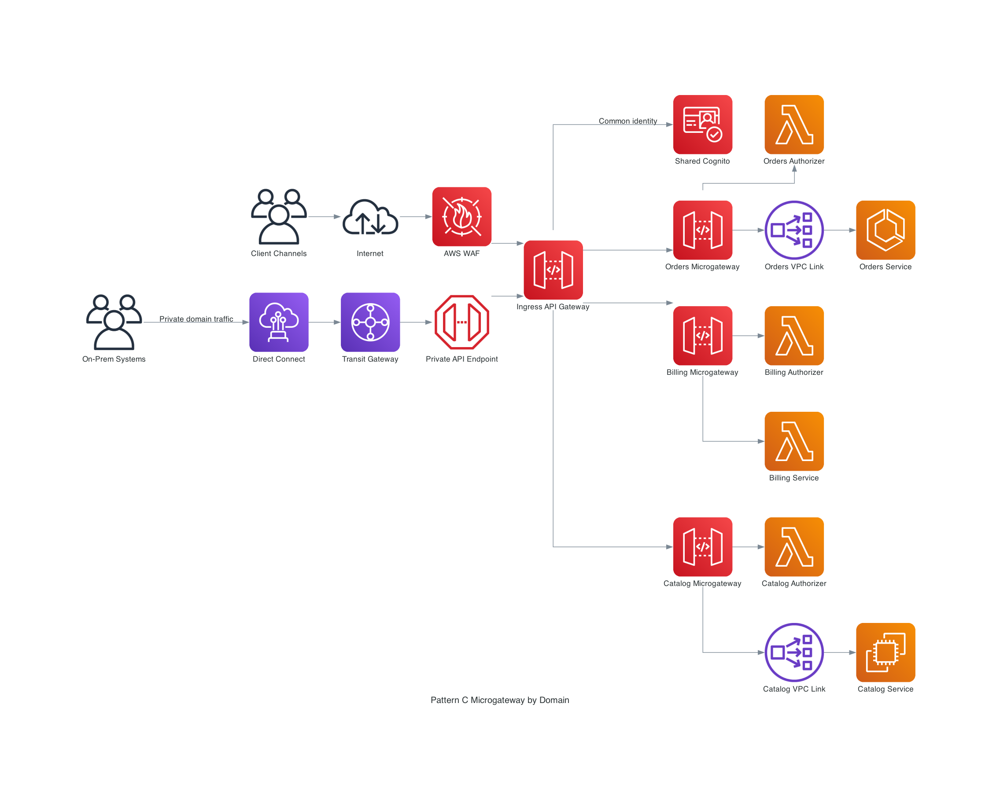
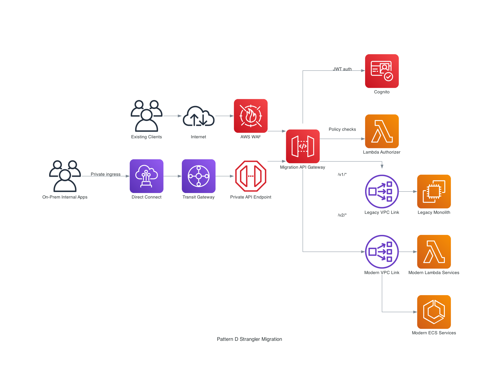
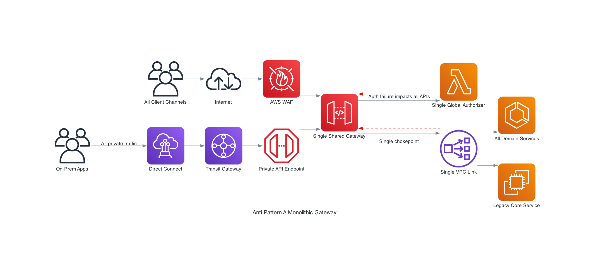
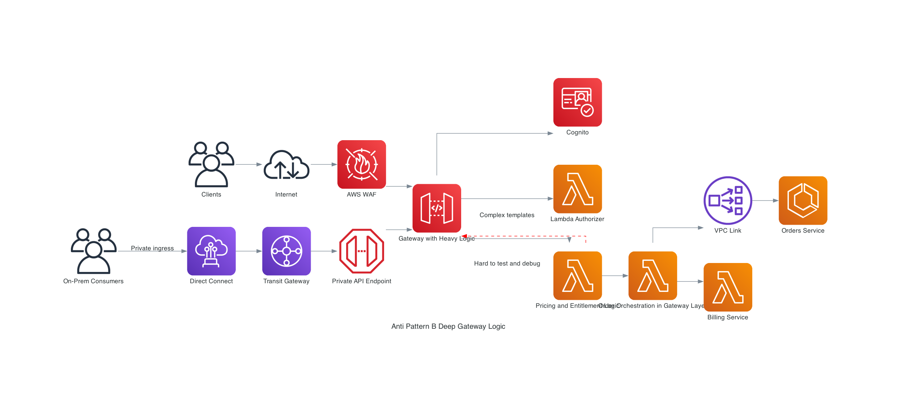
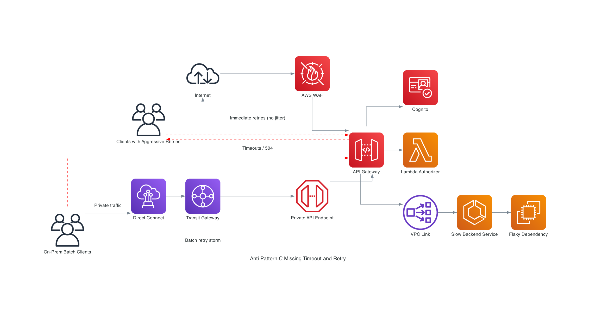

# AWS Direct Connect + API Gateway: Architecture Patterns Visual Guide

This guide focuses on **hybrid API architectures** where **AWS Direct Connect** provides private, predictable network transport and **Amazon API Gateway** provides API security, control, and traffic governance.

## 1) Core Functionalities

In this architecture style, responsibilities split cleanly:
- **AWS Direct Connect**: dedicated/private network path from on-premises to AWS.
- **API Gateway**: API front door for routing, security, throttling, and backend integration.

### Capability map

| Capability | What it does in a Direct Connect-centric API architecture | Design guidance |
| --- | --- | --- |
| Request Routing | API Gateway routes by path/method/route key to specific integrations; Direct Connect carries private client traffic into AWS | Keep route ownership by domain (`/orders`, `/billing`, `/catalog`) to avoid cross-team coupling |
| Authentication / Authorization | API Gateway enforces Cognito JWT, IAM, and Lambda authorizers before backend access | Enforce `deny-by-default`; secure both public and private (Direct Connect) paths |
| Throttling | API Gateway throttles bursts and protects backend services from overload | Set account + stage + route limits; treat limits as protection guardrails |
| Protocol Translation | API Gateway fronts Lambda, ECS services, and private backends via VPC Link; clients stay on HTTPS/WSS | Use proxy integrations by default; keep protocol bridges explicit |
| Payload Transformation | API Gateway can transform headers/body/parameters for compatibility boundaries | Keep transformations thin; move business behavior to backend services |

### Core traffic flow (Direct Connect + API Gateway + Security + Backends)

## 2) Use Cases: REST APIs vs HTTP APIs vs WebSocket APIs

| API Type | Best fit | Why choose it | Typical hybrid usage with Direct Connect |
| --- | --- | --- | --- |
| REST API | Enterprise APIs needing advanced controls | API keys, usage plans, richer governance and transformation capabilities | Internal/partner APIs over private connectivity, strict policy boundaries |
| HTTP API | High-throughput, low-latency APIs | Lower cost and operational overhead, JWT auth, simple routing | Modern synchronous APIs for web/mobile while on-prem systems connect privately |
| WebSocket API | Real-time bidirectional updates | Persistent connections and route-based events | Live operations dashboards where data sources are in private networks |

### Selection quick rules

1. Choose **REST API** when governance depth and product controls are critical.
2. Choose **HTTP API** when latency/cost efficiency is the primary objective.
3. Choose **WebSocket API** when server-to-client push is mandatory.

## 3) Architectural Patterns

### Pattern A: Centralized Edge Gateway

A single API Gateway edge layer handles ingress policy, then routes to multiple backends. Direct Connect brings on-prem clients privately into this edge.

When to use:
- You need consistent security and audit controls across many APIs.
- Multiple client channels must share one governed API front door.

Trade-offs:
- Strong central control.
- Requires clear domain route ownership to avoid bottlenecks.

Traffic flow:
1. Internet clients hit WAF then API Gateway.
2. On-prem clients enter through Direct Connect -> Transit Gateway -> private API endpoint.
3. API Gateway enforces Cognito/Lambda authorizer policies.
4. Requests route to Lambda and VPC-linked ECS/EC2 backends.

### Pattern B: Backend-for-Frontend (BFF)

Separate API front doors per channel (web, mobile, partner), each tuned to client needs while reusing shared domains.

When to use:
- Web/mobile/partner channels need different payloads, latency targets, and release cadence.
- You want channel autonomy without coupling all clients to one contract.

Trade-offs:
- Better user experience and team autonomy.
- More API surfaces to operate.

Traffic flow:
1. Web and mobile traffic enters via WAF to dedicated HTTP API BFFs.
2. Partner/on-prem traffic uses Direct Connect to a private REST API BFF.
3. Cognito and Lambda authorizers protect each channel boundary.
4. BFF APIs aggregate Lambda services and domain backends via VPC Link.

### Pattern C: Microgateway

Domain-owned gateway surfaces (orders, billing, catalog) sit behind an ingress layer. Direct Connect remains the private transport for internal clients.

When to use:
- You run a domain-oriented platform with independent teams.
- You need smaller blast radius for configuration or deployment changes.

Trade-offs:
- Strong ownership and bounded failure domains.
- Governance standards must be enforced platform-wide.

Traffic flow:
1. Shared ingress API receives internet and Direct Connect traffic.
2. Shared identity checks run at ingress.
3. Requests route to domain microgateways.
4. Domain-specific authorizers and backends execute independently.

### Pattern D: Strangler Fig

Use API Gateway routing to incrementally migrate from monolith to modern services, while preserving stable client contracts and private connectivity.

When to use:
- Legacy modernization must be incremental, not big-bang.
- Backward compatibility is mandatory.

Trade-offs:
- Safer migration path with measurable cutovers.
- Temporary dual-stack complexity.

Traffic flow:
1. Existing traffic (internet + Direct Connect) enters a migration gateway.
2. Security controls run consistently for old and new routes.
3. `/v1/*` routes to monolith via legacy VPC Link.
4. `/v2/*` routes to modern Lambda/ECS services via modern VPC Link.

## 4) Architectural Anti-Patterns

### Anti-Pattern A: Monolithic Gateway (Single Point of Failure)

One oversized shared gateway/auth path/integration path handles everything.

Why it is dangerous:
- Single failure impacts all domains and clients.
- Release velocity slows as teams contend on shared config.
- Blast radius is unacceptable for high-change systems.

Fix:
- Split by channel/domain (BFF or microgateway).
- Isolate authorizers and integration paths.
- Reduce mutable shared configuration.

### Anti-Pattern B: Deep Business Logic in the Gateway

Complex business orchestration lives in mapping templates/authorizers instead of versioned services.

Why it is dangerous:
- Hard to test, observe, and evolve safely.
- Couples policy tier with business workflows.
- Increases deployment risk at the gateway layer.

Fix:
- Keep gateway scope to ingress concerns (auth, routing, quotas).
- Move domain logic into Lambda/ECS services with normal SDLC controls.

### Anti-Pattern C: Missing Timeout/Retry Strategy

No clear timeout budgets and no bounded retry strategy across clients and services.

Why it is dangerous:
- Slow integrations cause timeout cascades.
- Uncontrolled retries create retry storms.
- API and backend saturation spreads quickly, including private links.

Fix:
- Define end-to-end timeout budgets.
- Use bounded retries with exponential backoff + jitter in one chosen layer.
- Add circuit breaking and graceful degradation for dependent services.

## Practical Implementation Checklist

1. Select Direct Connect model first (private/transit VIF, TGW/VGW attachment) based on topology.
2. Choose API type per workload (REST/HTTP/WebSocket) and lifecycle needs.
3. Enforce security on every route (Cognito/JWT/IAM/Lambda authorizer as appropriate).
4. Keep gateway transformations minimal and explicitly documented.
5. Apply throttling and observability per route/integration.
6. Set timeout and retry budgets before production cutover.
7. Favor migration patterns (Strangler) over big-bang replacement.

## References

- [AWS Direct Connect overview (Well-Architected Hybrid Networking Lens)](https://docs.aws.amazon.com/wellarchitected/latest/hybrid-networking-lens/aws-direct-connect.html)
- [Direct Connect virtual interfaces](https://docs.aws.amazon.com/directconnect/latest/UserGuide/WorkingWithVirtualInterfaces.html)
- [Choose between REST APIs and HTTP APIs](https://docs.aws.amazon.com/apigateway/latest/developerguide/http-api-vs-rest.html)
- [API Gateway concepts](https://docs.aws.amazon.com/apigateway/latest/developerguide/api-gateway-basic-concept.html)
- [Lambda authorizers](https://docs.aws.amazon.com/apigateway/latest/developerguide/apigateway-use-lambda-authorizer.html)
- [Control access to HTTP APIs](https://docs.aws.amazon.com/apigateway/latest/developerguide/http-api-access-control.html)
- [REST API throttling](https://docs.aws.amazon.com/apigateway/latest/developerguide/api-gateway-request-throttling.html)
- [HTTP API throttling](https://docs.aws.amazon.com/apigateway/latest/developerguide/http-api-throttling.html)
- [Private integrations for HTTP APIs](https://docs.aws.amazon.com/apigateway/latest/developerguide/http-api-develop-integrations-private.html)
- [Retry with backoff pattern (AWS Prescriptive Guidance)](https://docs.aws.amazon.com/prescriptive-guidance/latest/cloud-design-patterns/retry-backoff.html)
