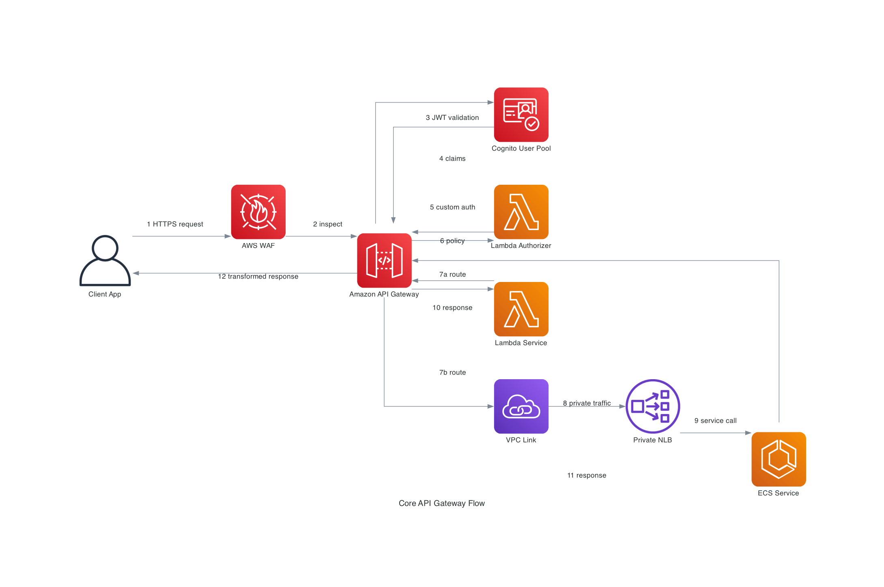
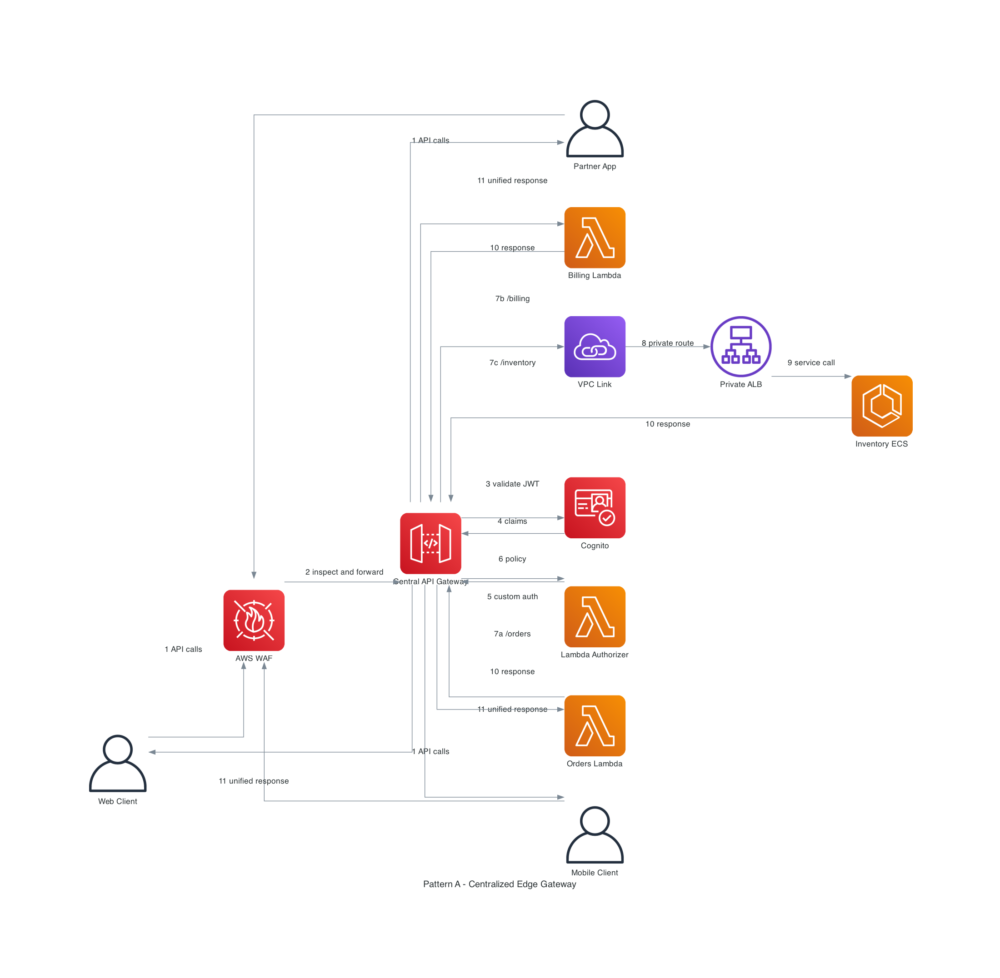
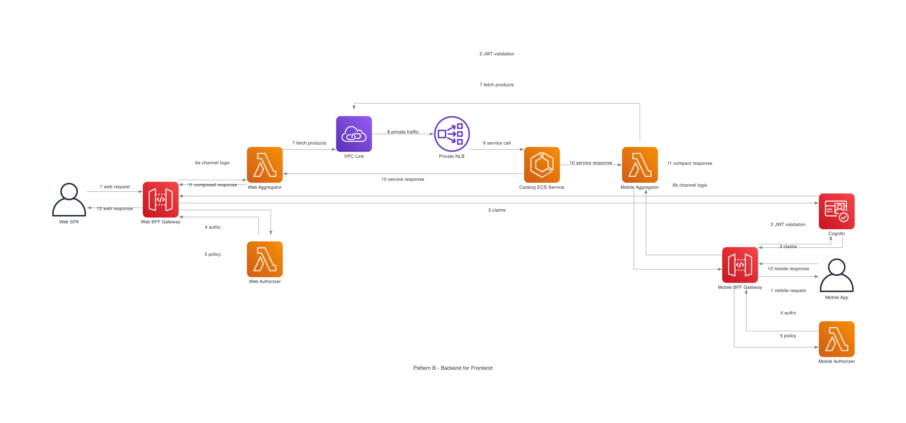
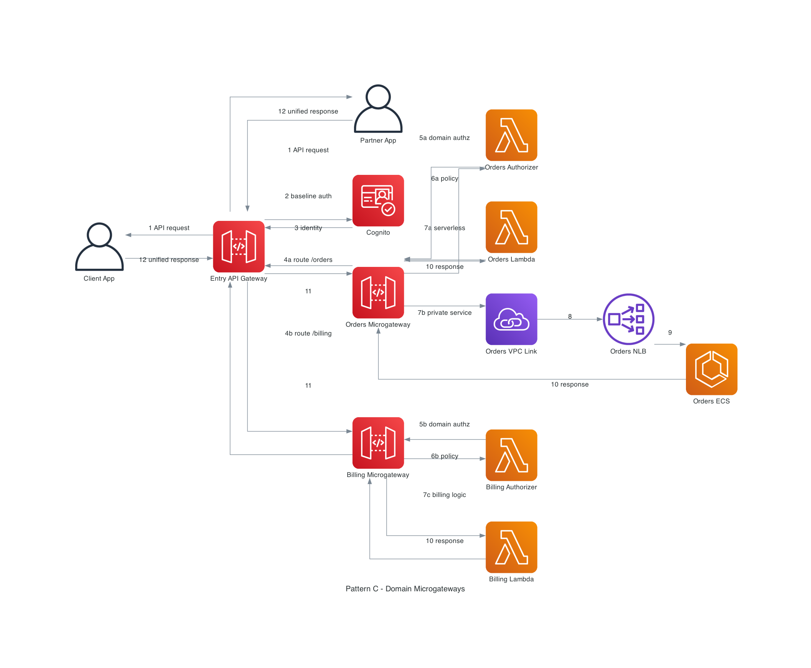
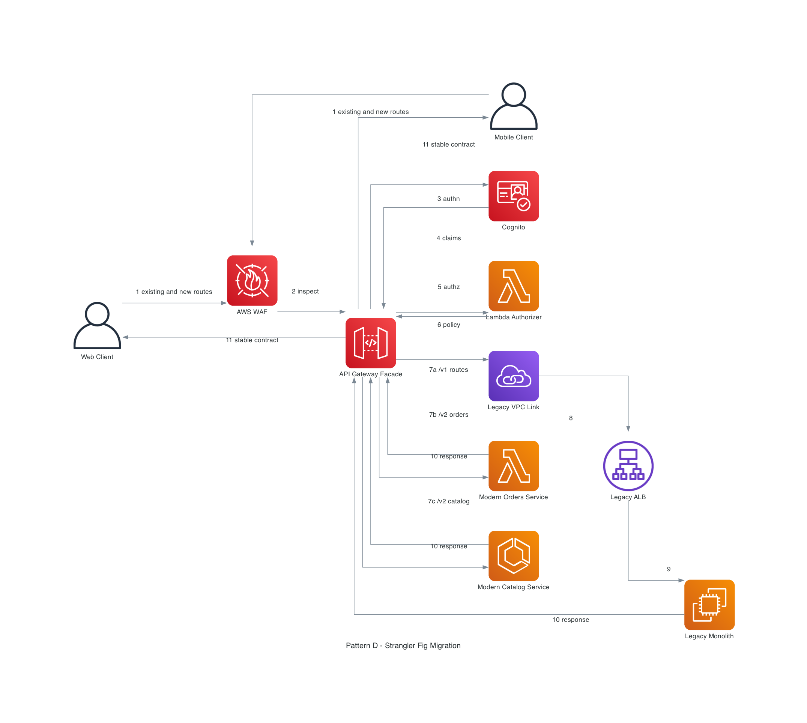
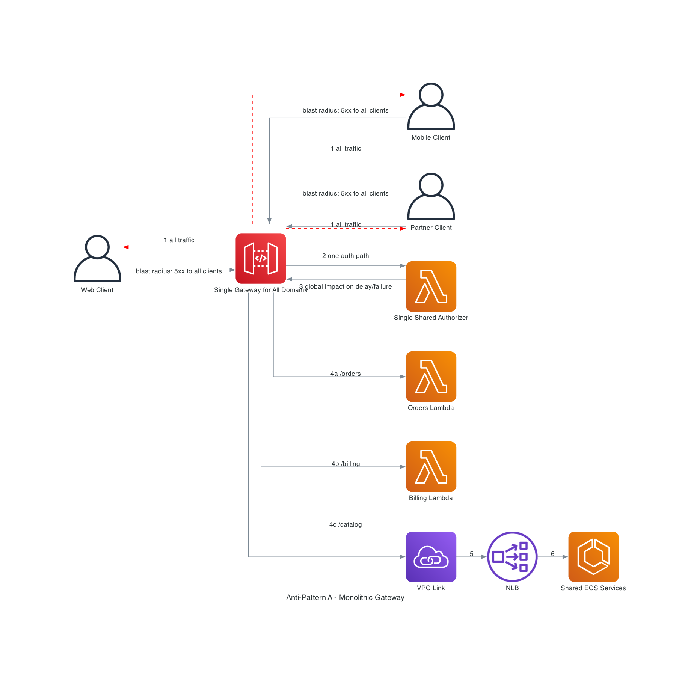
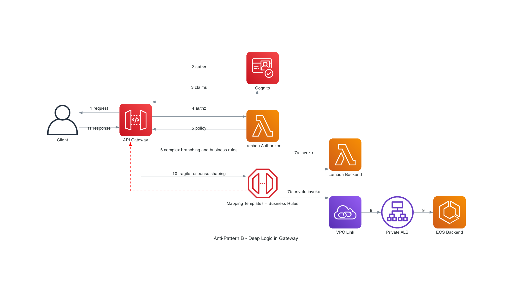
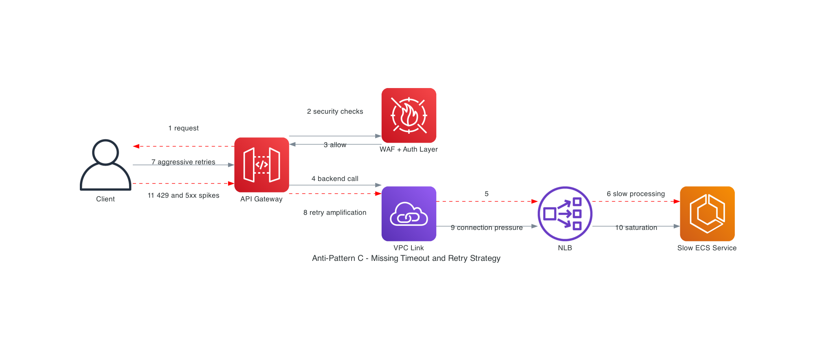

# AWS API Gateway Architecture Patterns - Visual Guide

> Scope note: your section requirements (REST vs HTTP vs WebSocket, authorizers, throttling, payload transformation) map to **Amazon API Gateway**. This guide follows that scope.

## 1. Core Functionalities

### 1.1 Request Routing
Amazon API Gateway routes incoming requests based on path, method, route key, stage, and custom domain mapping.

- REST API: resource + HTTP method routing (`/orders/{id}`, `GET`, `POST`)
- HTTP API: route-based routing with lower latency and simpler feature set
- WebSocket API: route key routing based on message content (`$connect`, `$disconnect`, custom action routes)

### 1.2 Authentication and Authorization
API Gateway supports multiple security controls at the edge and route level.

- Amazon Cognito user pools for JWT-based user auth
- Lambda authorizers for custom auth logic
- IAM authorization for service-to-service and signed requests
- Resource policies for source/network/account restrictions
- AWS WAF integration for Layer-7 filtering

### 1.3 Throttling and Quotas
API Gateway uses token-bucket throttling to protect downstream systems.

- Account-level limits apply first
- Stage/route/method limits further shape traffic
- Usage plans and API keys control per-consumer quotas
- Exceeded limits return `429 Too Many Requests`

### 1.4 Protocol Translation
API Gateway can bridge client and backend protocol expectations.

- HTTPS clients to Lambda integration
- HTTPS clients to private HTTP backends via VPC Link
- REST/HTTP front doors for legacy SOAP or XML-based backends through transformation layers

### 1.5 Payload Transformation
For REST APIs, API Gateway can transform request/response payloads through parameter mappings and mapping templates.

- Normalize client payloads before backend invocation
- Mask or reshape backend response objects
- Override headers/status codes in controlled scenarios

### Core Flow Reference Diagram

## 2. Use Cases: REST APIs vs HTTP APIs vs WebSocket APIs

| API Type | Best For | Key Strengths | Key Constraints | Typical Backends |
|---|---|---|---|---|
| REST API | Mature enterprise APIs, advanced request/response mapping, API products | Rich feature depth, API keys/usage plans, extensive transformation controls | Higher cost/latency than HTTP API | Lambda, ECS/EKS via VPC Link, AWS service integrations |
| HTTP API | High-throughput, low-latency APIs, straightforward proxy patterns | Lower cost, simpler config, fast deployments, JWT/OIDC support | Fewer advanced features than REST API | Lambda, ALB/NLB via VPC Link, Cloud Map |
| WebSocket API | Real-time bidirectional communication | Persistent connections, route-based real-time events | Requires connection lifecycle design and state handling | Lambda, HTTP backends, pub/sub systems |

### Fast Selection Logic

1. Choose **WebSocket API** when clients need bidirectional real-time communication.
2. If real-time bidirectional is not required, choose **REST API** for advanced governance and transformations.
3. Choose **HTTP API** for lower latency/cost when advanced REST-only controls are not required.

## 3. Architectural Patterns

## Pattern A: Centralized Edge Gateway
A single edge API layer centralizes authentication, throttling, observability, and routing to multiple backend domains.

When to use:
- You need one externally governed API front door
- Security/compliance controls must be consistent across teams
- You want shared policies (WAF, auth, quotas, logging)

Strengths:
- Unified security and governance
- Cleaner consumer experience
- Easier global policy rollout

Tradeoffs:
- Requires strong route/domain ownership model
- Can become team bottleneck without clear API lifecycle process

### Diagram: Centralized Edge Gateway

## Pattern B: Backend-for-Frontend (BFF)
Separate gateway surfaces per client channel, each optimized for device/user experience while still enforcing security and policy.

When to use:
- Web and mobile have materially different payload/latency needs
- Teams need independent release cycles by channel
- You want channel-specific aggregation logic

Strengths:
- Channel-optimized payloads
- Faster frontend iteration
- Reduced over-fetching

Tradeoffs:
- More APIs to manage
- Shared domain logic must stay in backend services (not duplicated in BFFs)

### Diagram: BFF Pattern

## Pattern C: Microgateway by Domain
Instead of one very large gateway surface, expose domain-scoped gateways (Orders, Billing, Catalog), each with independent ownership and lifecycle.

When to use:
- Platform is organized around domain teams
- You need independent policy/versioning per domain
- You want reduced blast radius for API changes

Strengths:
- Better team autonomy
- Smaller failure domains
- Cleaner domain boundaries

Tradeoffs:
- Requires robust service discovery/documentation
- Governance model must ensure consistent baseline controls

### Diagram: Microgateway Pattern

## Pattern D: Strangler Fig Modernization
Use API Gateway as a controlled facade to gradually move routes from legacy monolith to modern services without breaking clients.

When to use:
- You must modernize incrementally
- Backward compatibility is mandatory
- Legacy backend cannot be replaced in one cutover

Strengths:
- Low-risk migration path
- Gradual route-by-route modernization
- Observable cutover progress

Tradeoffs:
- Temporary dual-stack complexity
- Requires rigorous routing/version strategy

### Diagram: Strangler Fig Pattern

## 4. Architectural Anti-Patterns

## Anti-Pattern A: Monolithic Gateway (Single Point of Failure)
A single overloaded API Gateway deployment, one shared authorizer, and tightly coupled routing model create a large blast radius.

Why this fails:
- One faulty deployment affects all APIs
- Shared authorizer latency/failure impacts every route
- Difficult to scale team ownership and release safety

Safer alternative:
- Split APIs by domain or channel
- Use staged/canary deployments
- Isolate authorizers and throttling policies

### Diagram: Monolithic Gateway Anti-Pattern

## Anti-Pattern B: Deep Business Logic in the Gateway
Embedding orchestration and business decisions in mapping templates/authorizers/gateway layer causes rigidity and poor operability.

Why this fails:
- Gateway config becomes application code without proper SDLC controls
- Logic duplication across routes and stages
- Hard debugging and high change risk

Safer alternative:
- Keep gateway focused on edge concerns (auth, routing, throttling)
- Move domain logic to versioned Lambda/ECS services
- Use explicit contracts and contract tests

### Diagram: Deep Logic in Gateway Anti-Pattern

## Anti-Pattern C: Missing Timeout and Retry Strategy
No coherent timeout budget and retry policy causes retry storms, amplified latency, and cascading failures.

Why this fails:
- Clients retry aggressively while upstream calls are still running
- Connection pools saturate on private integrations
- Tail latency spikes into widespread errors

Safer alternative:
- Define end-to-end timeout budget (client, gateway, backend)
- Use controlled retries with jitter and idempotency keys
- Add circuit breakers and backpressure in backend tiers

### Diagram: Missing Timeout/Retry Anti-Pattern

## Implementation Checklist

- Pick API type by traffic pattern and feature requirements
- Enforce a standard auth stack (Cognito or OIDC + optional Lambda authorizer)
- Define throttling quotas at account + stage/route + consumer level
- Use VPC Link for private backends and keep integration ownership explicit
- Keep gateway logic thin; move business rules into backend services
- Define timeout/retry/idempotency budgets before production launch
- Add observability (access logs, metrics, traces, alarms) per route and backend

## References

- [Amazon API Gateway Overview](https://docs.aws.amazon.com/apigateway/latest/developerguide/api-gateway-overview-developer-experience.html)
- [API Gateway Concepts](https://docs.aws.amazon.com/apigateway/latest/developerguide/api-gateway-basic-concept.html)
- [Choose API Types (REST, HTTP, WebSocket)](https://docs.aws.amazon.com/serverless/latest/devguide/starter-apigw.html)
- [Lambda Authorizers](https://docs.aws.amazon.com/apigateway/latest/developerguide/apigateway-use-lambda-authorizer.html)
- [Cognito Authorizer for REST APIs](https://docs.aws.amazon.com/apigateway/latest/developerguide/apigateway-integrate-with-cognito.html)
- [REST API Throttling](https://docs.aws.amazon.com/apigateway/latest/developerguide/api-gateway-request-throttling.html)
- [HTTP API Throttling](https://docs.aws.amazon.com/apigateway/latest/developerguide/http-api-throttling.html)
- [API Gateway Quotas](https://docs.aws.amazon.com/apigateway/latest/developerguide/limits.html)
- [Data Transformations for REST APIs](https://docs.aws.amazon.com/apigateway/latest/developerguide/rest-api-data-transformations.html)
- [Mapping Template Transformations](https://docs.aws.amazon.com/apigateway/latest/developerguide/models-mappings.html)
- [Private Integrations for HTTP APIs](https://docs.aws.amazon.com/apigateway/latest/developerguide/http-api-develop-integrations-private.html)
- [Set Up Private Integrations](https://docs.aws.amazon.com/apigateway/latest/developerguide/set-up-private-integration.html)
