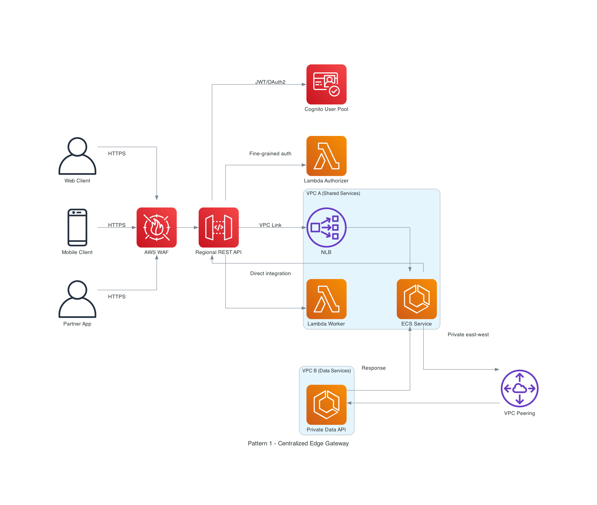
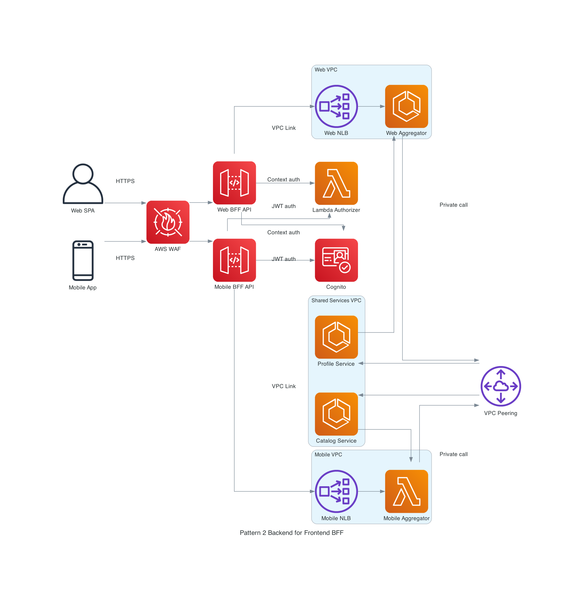
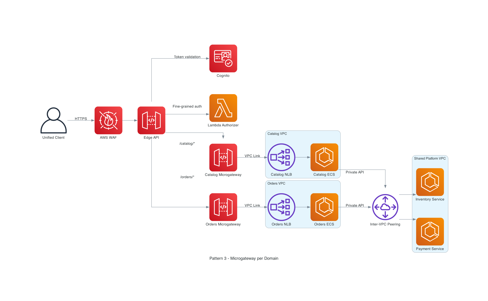
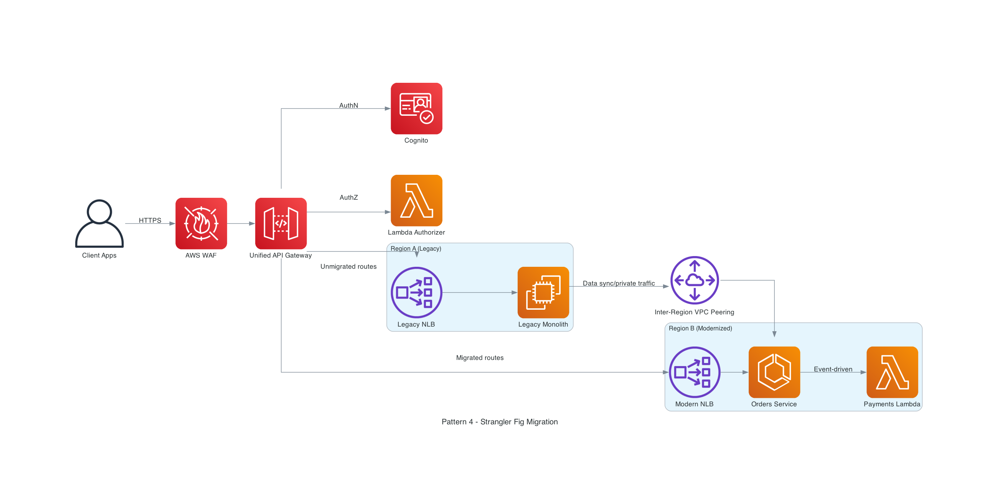
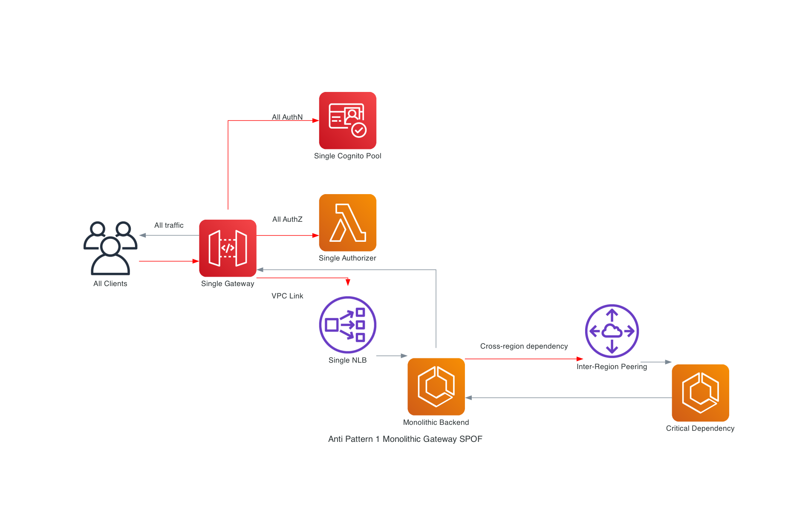
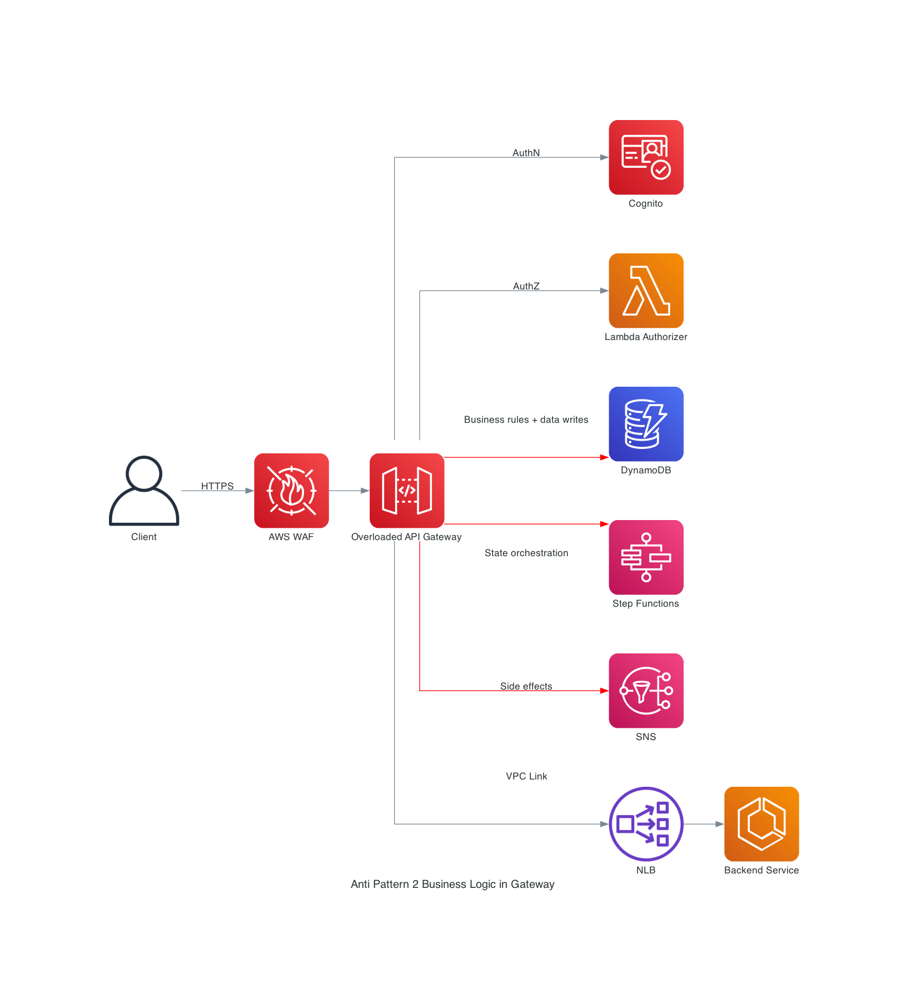
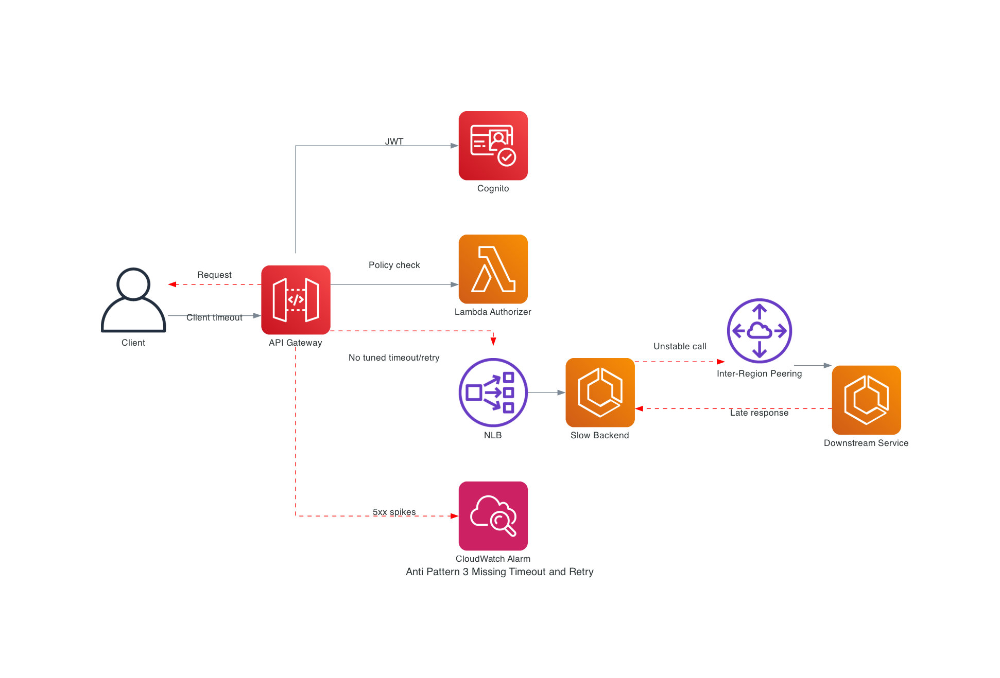

# VPC Peering & Inter-Region Peering: API Gateway Architecture Patterns

This guide explains how to design API Gateway-centric architectures that rely on VPC peering and inter-Region peering for private service-to-service connectivity.

## 1. Core Functionalities

| Capability | What it does in API Gateway | VPC Peering / Inter-Region impact |
| --- | --- | --- |
| Request Routing | Routes by host, path, method, and route key (WebSocket) to target integrations. | Keep east-west service traffic private behind VPC Link + peered VPCs. |
| Authentication / Authorization | Supports IAM, Cognito/JWT, Lambda authorizers, and resource policies (REST). | Enforce identity at the edge before traffic reaches peered private networks. |
| Throttling | Controls traffic bursts and steady-state request rates (REST has per-client controls via API keys/usage plans). | Prevent saturation of private links and downstream services across peering. |
| Protocol Translation | Exposes REST/HTTP/WebSocket front doors while integrating with Lambda, HTTP, ALB/NLB, and AWS services. | Allows internet-facing APIs while keeping backend protocols and network topology private. |
| Payload Transformation | REST supports rich mapping templates; HTTP APIs support parameter mapping for lighter transformations. | Normalize payloads at entry to reduce coupling across VPC boundaries and Regions. |

### VPC peering realities you must design around

1. Peering is one-to-one and non-transitive.
2. CIDR blocks must not overlap.
3. Route tables must be updated on both sides.
4. Security groups/NACLs still gate traffic.
5. Inter-Region peering traffic stays on the AWS backbone and is encrypted in transit.
6. Inter-Region peering MTU differs from same-Region peering (8500 vs 9001 jumbo frames).
7. You cannot use peering for edge-to-edge transit (for example, one VPC using another VPC's NAT/IGW/VPN/DX).

## 2. Use Cases: REST APIs vs HTTP APIs vs WebSocket APIs

| API Type | Choose it when | Typical peering-oriented design |
| --- | --- | --- |
| REST API | You need advanced API management: API keys, usage plans, request validation, WAF integration, private REST endpoints, caching, canary releases. | Shared enterprise edge API with strict governance and private integrations to ALB/NLB in peered VPCs. |
| HTTP API | You need lower cost and lower latency with simpler feature needs, plus JWT/OIDC and Lambda authorizers. | High-volume front door to private ECS/ALB/NLB services over VPC Link in peered VPC topologies. |
| WebSocket API | You need bidirectional real-time communication (chat, collaboration, telemetry push). | Real-time control plane at the edge, with private domain services in peered VPCs handling state/events. |

## 3. Architectural Patterns

### Pattern A: Centralized Edge Gateway

A single edge API entry point enforces common security and governance, then routes to shared services over VPC Link and to peered data VPCs.

**Traffic flow**
1. Clients call API Gateway through AWS WAF.
2. API Gateway validates identity with Cognito and Lambda authorizer logic.
3. Routes invoke Lambda directly or private ECS services through VPC Link + NLB.
4. Backend services access private dependencies through VPC peering.
5. Response returns through API Gateway to clients.

### Pattern B: Backend-for-Frontend (BFF)

Separate APIs for web and mobile clients reduce over-fetching, isolate release cadence, and keep private service access controlled via peering.

**Traffic flow**
1. Web and mobile clients hit dedicated BFF APIs.
2. Both APIs apply Cognito/Lambda-authorizer security at the edge.
3. Each BFF reaches its backend via VPC Link.
4. Domain-specific aggregators call shared services in another VPC via peering.
5. Tailored payloads are returned per client channel.

### Pattern C: Microgateway per Domain

An edge API dispatches to domain microgateways (for example, Catalog and Orders), each owning security posture and backend integration independently.

**Traffic flow**
1. Client calls edge API through WAF.
2. Edge layer enforces auth and routes by domain path.
3. Domain microgateways call private ECS services through dedicated VPC Links.
4. Domain services access shared platform services across peered VPCs.
5. Responses are composed and returned upstream.

### Pattern D: Strangler Fig Modernization

A unified API front door gradually shifts routes from legacy systems to modern services, including cross-Region migration paths.

**Traffic flow**
1. Clients keep one API endpoint.
2. Security remains centralized with Cognito + Lambda authorizer.
3. Legacy routes go to Region A monolith.
4. Migrated routes go to Region B modern services.
5. Inter-Region peering supports private synchronization during transition.

## 4. Architectural Anti-Patterns

### Anti-Pattern A: Monolithic Gateway (Single Point of Failure)

Everything depends on one gateway path, one auth chain, and one backend path. Operationally, this creates blast-radius amplification and brittle scaling.

**Failure mode**
1. All traffic converges on one gateway and one authorizer path.
2. One overloaded backend path throttles or fails everything.
3. Cross-Region dependency latency amplifies global failures.

**Better approach**
- Split gateways by domain/BFF.
- Decouple authorizers and backend paths.
- Add regional resilience and failover strategy.

### Anti-Pattern B: Deep Business Logic Embedded in Gateway

Gateway mapping rules become a pseudo-application tier (state transitions, data writes, orchestration), making change control and debugging difficult.

**Failure mode**
1. API Gateway performs complex orchestration logic.
2. Tight coupling to data stores/workflows increases deployment risk.
3. Simple route changes become high-risk platform changes.

**Better approach**
- Keep gateway logic to routing, auth, throttling, and light transformation.
- Move business rules to versioned backend services.
- Keep policy and domain logic separately owned.

### Anti-Pattern C: Missing Timeout / Retry / Failure Policies

Without explicit timeout budgets and retry boundaries, peered and inter-Region calls can trigger cascading failures and client-visible outages.

**Failure mode**
1. Requests traverse gateway -> VPC Link -> backend with default/untuned timeout behavior.
2. Slow downstream inter-Region calls stack up.
3. Retries are absent or uncontrolled, leading to 5xx spikes and client timeouts.

**Better approach**
- Define per-hop timeout budgets.
- Apply bounded retries with backoff and idempotency.
- Add circuit breakers, bulkheads, and degradation paths.

## Source Notes (AWS Docs)

- API Gateway overview and feature model: https://docs.aws.amazon.com/apigateway/latest/developerguide/welcome.html
- REST vs HTTP API differences: https://docs.aws.amazon.com/apigateway/latest/developerguide/http-api-vs-rest.html
- WebSocket API behavior: https://docs.aws.amazon.com/apigateway/latest/developerguide/apigateway-websocket-api.html
- Private integrations and VPC Link: https://docs.aws.amazon.com/apigateway/latest/developerguide/http-api-develop-integrations-private.html
- REST private integration setup: https://docs.aws.amazon.com/apigateway/latest/developerguide/set-up-private-integration.html
- VPC peering fundamentals and limitations: https://docs.aws.amazon.com/vpc/latest/peering/vpc-peering-basics.html
- Inter-Region peering behavior and encryption note: https://docs.aws.amazon.com/vpc/latest/peering/what-is-vpc-peering.html
